# SecureBankito

Sistema bancario con microservicios que implementa los modelos de seguridad **Biba** y **Bell-LaPadula**.

## Diagramas y Justificación Diseño

| Diagrama | Archivo |
|---|---|
| DDD IAM | [docs/diagramas/SoADDD_IAM.drawio.svg](docs/diagramas/SoADDDIAM.drawio.svg) |
| DDD Core Bancario | [docs/diagramas/SoADDDCoreBanco.drawio.svg](docs/diagramas/SoADDDCoreBanco.drawio.svg) |
| DDD Inversiones | [docs/diagramas/SoADDDInversion.drawio.svg](docs/diagramas/SoADDDInversion.drawio.svg) |
| Flujo Escenario A | [docs/diagramas/SoAFlujoI.drawio.svg](docs/diagramas/SoAFlujoI.drawio.svg) |
| Flujo Escenario B | [docs/diagramas/SoAFlujoII.drawio.svg](docs/diagramas/SoAFlujoII.drawio.svg) |
| Flujo de Escenario Exitoso | [docs/diagramas/SoAFlujoIII.drawio.svg](docs/diagramas/SoAFlujoIII.drawio.svg) |
| Justificación de diseño | [docs/Diseño_SOA.pdf](docs/Diseño_SOA.pdf) |
| Documentación de la API | [docs/openapi.yaml](docs/openapi.yaml) |

## Arquitectura de SecureBankito

Este diagrama muestra la arquitectura del proyecto en terminos de servicios y bases de datos.



### Servicios y bases de datos

| Servicio | URL local | Base de datos | Responsabilidad |
|---|---:|---|---|
| `iam-service` | `http://127.0.0.1:3001` | `iam_db` | Registro, login, validacion de JWT |
| `corebancario-service` | `http://127.0.0.1:3002` | `corebancario_db` |  Cuentas y transferencias con modelo Biba |
| `inversiones-service` | `http://127.0.0.1:3003` | `inversiones_db` | Activos VIP con modelo Bell-LaPadula |

- Cada microservicio tiene su propia base PostgreSQL independiente.
- No hay una base de datos compartida entre servicios.
- IAM emite el JWT y los otros servicios validan ese token con el mismo `JWT_SECRET`.
- El acceso desde la maquina local se hace con `kubectl port-forward` hacia los servicios `ClusterIP`.

### Sobre API Gateway

Esta implementacion no usa API Gateway porque se enfoca en demostrar tres dominios desacoplados, aislamiento de datos y reglas de seguridad aplicadas.

En esta arquitectura se consume directamente cada microservicio por su puerto local:

- IAM: `http://127.0.0.1:3001`
- Core Bancario: `http://127.0.0.1:3002`
- Inversiones: `http://127.0.0.1:3003`

La autenticacion se centraliza en IAM mediante JWT, pero las reglas criticas no dependen de una capa externa:

- Core Bancario valida Biba dentro del dominio antes de crear cuentas o ejecutar transferencias.
- Inversiones valida Bell-LaPadula dentro del dominio antes de listar u obtener activos VIP.

## Ejecucion con Kubernetes

Requisitos:

- Docker Desktop
- Minikube
- kubectl
- PowerShell

Desde la raiz del proyecto, ejecutar:

```powershell
.\k8s\deploy.ps1
```

URLs locales para Postman:

```text
http://127.0.0.1:3001/health
http://127.0.0.1:3002/health
http://127.0.0.1:3003/health
```

Si solo se quieren abrir los port-forwards sin redeploy:

```powershell
.\k8s\port-forward-all.ps1
```

Verificar los pods:

```powershell
kubectl get pods -n securebankito
```

Verificar los servicios:

```powershell
kubectl get svc -n securebankito
```

El despliegue ejecuta las semillas automaticamente. Para ejecutarlas manualmente:

```powershell
kubectl exec -n securebankito deployment/iam-service -- node db/seed.js
kubectl exec -n securebankito deployment/corebancario-service -- node db/seed.js
kubectl exec -n securebankito deployment/inversiones-service -- node db/seed.js
```

## Ejecución con docker

```bash
docker compose up -d --build
```

### Seeds

```bash
docker compose exec iam-service node db/seed.js
docker compose exec corebancario-service node db/seed.js
docker compose exec inversiones-service node db/seed.js
```

---

## Endpoints

### IAM Service - `http://localhost:3001`

| Método | Endpoint         | Auth | Descripción                  |
|--------|-----------------|------|------------------------------|
| POST   | `/auth/register` | No   | Registrar usuario            |
| POST   | `/auth/login`    | No   | Login - retorna JWT          |
| GET    | `/auth/validate` | Si   | Validar token                |
| GET    | `/health`        | No   | Health check                 |

### Core Bancario Service - `http://localhost:3002`

Modelo **Biba** - No Write Up.

| Método | Endpoint                           | Auth | Descripción                  |
|--------|-----------------------------------|------|------------------------------|
| POST   | `/cuentas`                         | Si   | Crear cuenta                 |
| GET    | `/cuentas`                         | Si   | Listar cuentas               |
| GET    | `/cuentas/:cuentaId`               | Si   | Obtener cuenta               |
| GET    | `/cuentas/:cuentaId/transacciones` | Si   | Historial de transacciones   |
| POST   | `/transferencias`                  | Si   | Ejecutar transferencia       |
| GET    | `/health`                          | No   | Health check                 |

### Inversiones Service - `http://localhost:3003`

Modelo **Bell-LaPadula** - No Read Up.

| Método | Endpoint           | Auth | Descripción          |
|--------|--------------------|------|----------------------|
| GET    | `/activos-vip`     | Si   | Listar activos VIP   |
| GET    | `/activos-vip/:id` | Si   | Obtener activo       |
| POST   | `/activos-vip`     | Si   | Crear activo VIP     |
| GET    | `/health`          | No   | Health check         |

---

## Usuarios seed

| Usuario          | Contraseña | Clearance | Integrity |
|------------------|-----------|-----------|-----------|
| `usuario_oro`    | `pass123` | ORO       | 3         |
| `usuario_plata`  | `pass123` | PLATA     | 2         |
| `usuario_bronce` | `pass123` | BRONCE    | 1         |

---

## Ejemplos de pruebas

### Login

```http
POST http://127.0.0.1:3001/auth/login
```

```json
{
  "username": "usuario_oro",
  "password": "pass123"
}
```

La respuesta incluye un `token`. Usarlo como Bearer Token en los endpoints protegidos.

### Listar cuentas

```http
GET http://127.0.0.1:3002/cuentas
Authorization: Bearer <TOKEN>
```

Copiar el `cuentaId` real de la respuesta para usarlo en transferencias.

### Transferencia

```http
POST http://127.0.0.1:3002/transferencias
Authorization: Bearer <TOKEN>
```

```json
{
  "cuentaDestinoId": "<CUENTA_ID>",
  "monto": 500,
  "moneda": "USD"
}
```

### Listar activos VIP

```http
GET http://127.0.0.1:3003/activos-vip
Authorization: Bearer <TOKEN>
```

Con `usuario_plata` debe responder `403 BLP_VIOLATION`. Con `usuario_oro` debe responder `200`.

---
