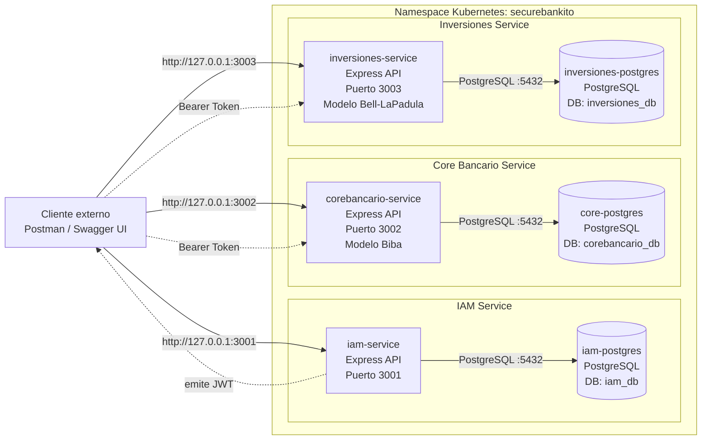

# Arquitectura de SecureBankito

Este diagrama muestra la arquitectura del proyecto en terminos de servicios y bases de datos.

## Servicios y bases de datos

| Servicio | URL local | Base de datos | Usuario DB | Responsabilidad |
|---|---:|---|---|---|
| `iam-service` | `http://127.0.0.1:3001` | `iam_db` | `iam_user` | Registro, login, validacion de JWT |
| `corebancario-service` | `http://127.0.0.1:3002` | `corebancario_db` | `core_user` | Cuentas y transferencias con modelo Biba |
| `inversiones-service` | `http://127.0.0.1:3003` | `inversiones_db` | `inv_user` | Activos VIP con modelo Bell-LaPadula |

- Cada microservicio tiene su propia base PostgreSQL independiente.
- No hay una base de datos compartida entre servicios.
- IAM emite el JWT y los otros servicios validan ese token con el mismo `JWT_SECRET`.
- El acceso desde la maquina local se hace con `kubectl port-forward` hacia los servicios `ClusterIP`.

## Sobre API Gateway

Esta implementacion no usa API Gateway porque el alcance solicitado se enfoca en demostrar tres dominios desacoplados, aislamiento de datos y reglas de seguridad aplicadas dentro del dominio.

En esta arquitectura se consume directamente cada microservicio por su puerto local:

- IAM: `http://127.0.0.1:3001`
- Core Bancario: `http://127.0.0.1:3002`
- Inversiones: `http://127.0.0.1:3003`

La autenticacion se centraliza en IAM mediante JWT, pero las reglas criticas no dependen de una capa externa:

- Core Bancario valida Biba dentro del dominio antes de crear cuentas o ejecutar transferencias.
- Inversiones valida Bell-LaPadula dentro del dominio antes de listar u obtener activos VIP.

## Endpoints principales por servicio

| Servicio | Endpoints |
|---|---|
| IAM | `/auth/register`, `/auth/login`, `/auth/validate`, `/health` |
| Core Bancario | `/cuentas`, `/cuentas/{cuentaId}`, `/cuentas/{cuentaId}/transacciones`, `/transferencias`, `/health` |
| Inversiones | `/activos-vip`, `/activos-vip/{activoId}`, `/health` |
